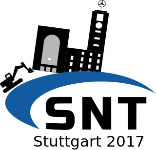
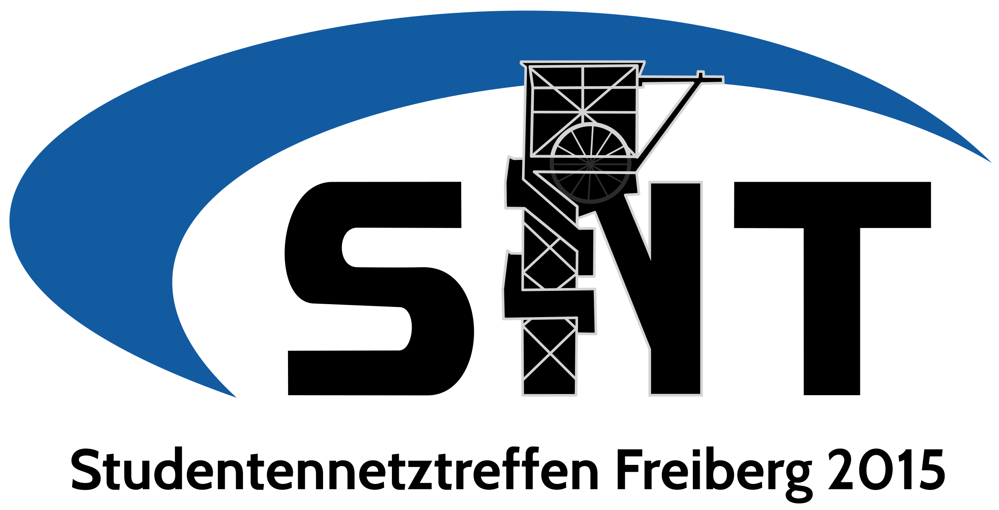
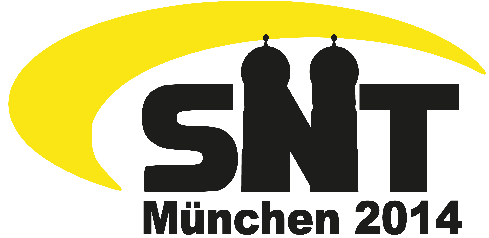

# Overview

-   [SNT 2023](snt2023.md) Dresden { width="100" }
-   SNT 2022 - *cancelled because of COVID-19*
-   SNT 2021 - *cancelled because of COVID-19*
-   SNT 2020 Paris - *cancelled because of COVID-19*
-   [SNT 2019](snt2019.md) Bratislava
-   [SNT 2018](snt2018.md) Prague { width="100" }
-   [SNT 2017](snt2017.md) Stuttgart { width="100" }
-   [SNT 2016](snt2016.md) Dresden { width="100" }
-   [SNT 2015](snt2015.md) Freiberg/Sa. { width="100" }
-   [SNT 2014](snt2014.md) Munich { width="100" }
-   [SNT 2013](snt2013.md) Nuremberg { width="100" }
-   [SNT 2012](snt2012.md) Ilmenau { width="100" }
-   [SNT 2011](snt2011.md) Stuttgart
-   [SNT 2010](snt2010.md) Dresden
-   [SNT 2009](snt2009.md) Tübingen
-   [SNT 2008](snt2008.md) Tübingen - *cancelled*
-   [SNT 2007](snt2007.md) Mittweida { width="100" }
-   [SNT 2006](snt2006.md) Braunschweig { width="100" }
-   [SNT 2005](snt2005.md) Ilmenau
-   [SNT 2004](snt2004.md) Chemnitz
