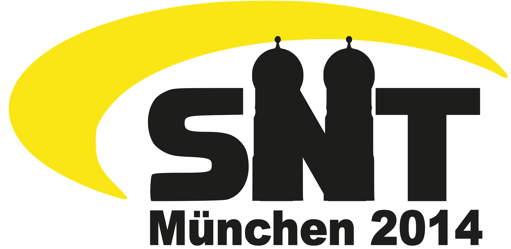

# SNT 2014, Munich

{width="450"}

- Austragungsort: München
- Termin: 11.09. bis 14.09.2014
- Übernachtung: wahrscheinlich 2 Möglichkeiten: Wohnheim oder Hostel,
  details folgen
- Veranstalter: [StuStanet e. V.](../networks/munich_stustanet.md),
  Hans-Leipelt-Straße 7, 80805 München

### Teilnehmer

Name                                                                   | gemeldete Teilnehmerzahl
-----------------------------------------------------------------------|--------------------------
[St-Peter Nürnberg](../networks/nuremberg_st-peter.md)                 | 4
[SielNet e. V., Braunschweig](../networks/braunschweig_sielnet.md)     | 3
[Studentennetz Freiberg](../networks/freiberg_sfg.md)                  | 3
[Selfnet e.V.&WH-Netz e.V.](../networks/stuttgart_selfnet.md)          | 6
[Mittweidaer CampusNet (MCN), Mittweida](../networks/mittweida_mcn.md) | 1
[FeM](../networks/ilmenau_fem.md)                                      | 3
SNT-Archiv&Chronik                                                     | 1
[AG DSN](../networks/dresden_agdsn.md)                                 | 5

### Zeitplan (vorläufig)

Tag         |         Donnerstag         |            Freitag              |          Samstag          | Sonntag
------------|-------------------------- -|---------------------------------|---------------------------|-----------------------
            |                            |         **Frühstück**           |                           | 
Vormittag   |                            |     10:00 Führung SuperMUC      |   9:30 Deutsches Museum   | gemütl. Beisammensein
            |                            |        **Mittagessen**          |                           | Abreise
Nachmittag  |          Ankunft           | die Wohnheime stellen sich vor  |   15:00 Brauereiführung   | 
            |  Führung durch die StuSta  |            Vorträge             |         Vorträge          | 
 Abend      |          Grillen           |     Abendessen (TribüHne)       | Abendessen (Potschamperl) | 
            |   gemütl. Beisammensein    |     gemütl. Beisammensein       |   gemütl. Beisammensein   | 

Bei Fragen email an snt2014-orga@lists.stusta.mhn.de oder via jabber
direkt fragen: markus.kaindl@stusta.mhn.de oder *tobedone*

### Vorträge

Aktuelle Vorträge:

- Die Netze stellen sich vor
- WLAN bei der FeM (rei)
- Das SNT-Archiv packt aus

Eine Bitte, wenn jemand Vorträge hat und diesen gerne halten würde -
kurze Nachricht per Jabber (markus.kaindl@stusta.mhn.de) oder E-Mail:
snt2014-orga@lists.stusta.mhn.de

### Vor Ort

Ausgangsort, Treffpunkt und Frühstück ist im EWH-Vorbau

- <http://osm.org/go/0JBgHFQsS?m=&way=60321098>

Unterkunft in der StuSta (Haus 10, Erich-Markel-Haus)

- <http://osm.org/go/0JBgF4rIG?m=&way=172016101>

Unterkunft im Hostel (haus international)

- <http://osm.org/go/0JAf1FkOM--?m=&node=2194227509>
- <http://www.haus-international.de/de/>
