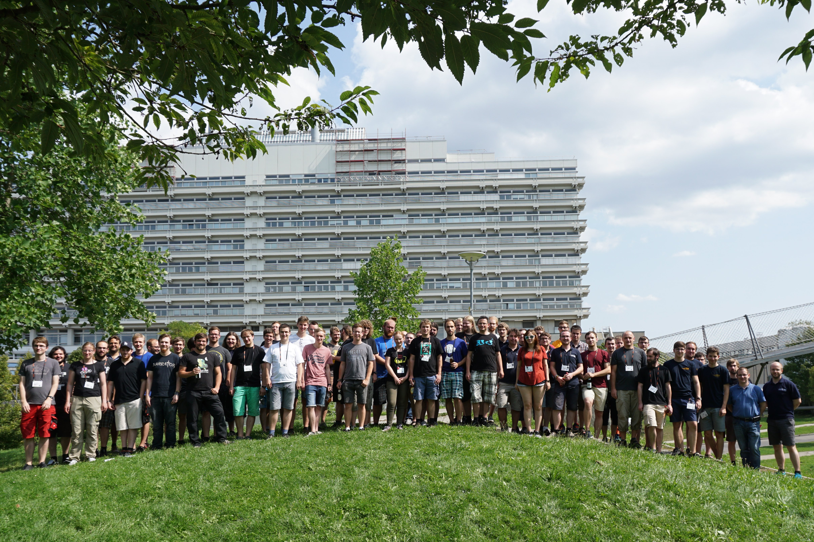

# SNT 2017, Stuttgart

{width="450"}

- Austragungsort: [Stuttgart](http://de.wikipedia.org/wiki/Stuttgart)
- Termin: 24.08.2017 bis 27.08.2017
- Übernachtung: wahrscheinlich in Wohnheimen vom Studierendenwerk Stuttgart
- Veranstalter: [Selfnet e.V.](../networks/stuttgart_selfnet.md)

## Präsentationen

### Netz-Vorstellungen

  Studentennetz                      | Sprecher                                                                                | Folien
  -------------------------------------- | ------------------------------------ | ---------------------------------------------------------
  [AG DSN - Dresden](../networks/dresden_agdsn.md) |  [Friedrich](mailto:toothstone (αt) agdsn.de)  |   

## Teilnehmer

Bitte tragt zeitnah (möglichst bis Ende Januar) in diese Liste ein, wie
viele von euch teilnehmen. Falls ihr keinen Wiki-Account habt, pingt
`show` oder `neuner` z.B. im `#studnetze` IRC, wir tragen das dann ein.

  Studentennetz/Name |                                                      Teilnehmer |  Schlafplätze  |  Essenswünsche (z.B. vegetarisch/Unverträglichkeiten, usw.)
  --------------------------------------------------------------------------- | ------------ | -------------- | ------------------------------------------------------------
  SNT-Archiv & Chronik (MikeTsenatek,Jean-Luc, Siggi) |                         3 |            3 |
  [Studierendenwerk Karlsruhe](../networks/karlsruhe_studierendenwerk.md) & SCC |   4 |            0 |
  [StuStaNet München](../networks/munich_stustanet.md) |  9 |            9 |  1x vegetarisch
  [Rommelwood e.V.](../networks/erlangen_rommelwood.md) |  5 |            5 |  2x vegetarisch
  [Sielnet e. V.](../networks/braunschweig_sielnet.md) |  1 |            1 |              
  [AG DSN](../networks/dresden_agdsn.md) | 12 |           12 |  2x vegetarisch
  NetzAGs Aachen | 0 |            0 |              
  [StuNet Freiberg](../networks/freiberg_sfg.md) |  5 |            5 |              
  [FeM e.V. - Ilmenau](../networks/ilmenau_fem.md) |  5 |            5 |              
  StudiNet (AStA Hochschule Karlsruhe) |  1 |            1 |              
  [Silicon Hill (CZ)](../networks/prague_silicon-hill.md) |  6 |            6 |  1x gluten-free

## Programm

**DRAFT!**

| Uhrzeit | Donnerstag (24.) | Freitag (25.) | Samstag (26.) | Sonntag (27.) |
| - | - | - | - | - |
| 8:00 Uhr |  | Frühstück |  |  |
| 9:00 Uhr |  | Blockheizkraftwerk | Frühstück | Frühstück |
| 10:00 Uhr |  | Blockheizkraftwerk | Chillen/Vorträge |  |
| 12:00 Uhr |  | Mittagessen | Mittagessen | EOF |
| 14:00 Uhr | hello world | Bunkerführung | Chillen/Vorträge |  |
| 16:00 Uhr | opening | Bunkerführung | Chillen/Vorträge |  |
| 18:00 Uhr | Abendessen | Abendessen | Abendessen |  |
| 20:00 Uhr | Netze-Vorstellungen | Spiele | Spiele |  |

Es wird ein paar Ausflüge und Vorträge geben, die aktuell noch in
Planung sind.

Ideen/Wünsche/Vorschläge für Vorträge können gerne noch eingereicht
werden!

## Essensplan

- **Donnerstag**
  - Abends
    - Linseneintopf mit Saiten
    - Spätzle
    - Grüner Salat
    - Champignontopf (vegetarisch)
    - Schwäbischer Ofenschlupfer (Nachtisch, Hefezopfspeise mit Quark und Apfel)
- **Freitags**
  - Frühstück
    - Brötchen, Brezeln, Crossaints
    - Marmelade, Nutella, Honig
    - Käse, Wurst
    - Cornflakes, Müsli
    - Gekochte Eier
  - Mittags: Generell belegte Brötchen
    - Belegte Brötchen
    - Spaghetti Carbonara (warmes Essen für 20-30 Personen)
    - Spaghetti mit Cocktailtomaten, Basilikum, Parmesan und Pinienkernen (vegetarisch)
  - Abends
    - Schnitzel Wiener Art
    - Blumenkohlschnitzel (vegetarisch)
    - Schwäbischer Kartoffelsalat
    - Petersilienkartoffeln
    - Rahmsauce, Champignonsauce
    - Erbsen & Möhren
    - Milchreis mit Apfelkompott (Nachtisch)
- **Samstags**
  - Frühstück
    - Brötchen, Brezeln, Crossaints
    - Marmelade, Nutella, Honig
    - Käse, Wurst
    - Cornflakes, Müsli
    - Gekochte Eier
  - Abends: Grillen
    - Schaschlick
    - Bratwurst grob/fein (und Currywurst)
    - Steak (Rücken, Nacken)
    - Kartoffeln mit Quark (vegetarisch)
    - Garnelenspieße
    - Grillkäse (vegetarisch)
    - Maiskolben mit Butter
    - Gefüllte Tomaten und Champignons (vegetarisch)
    - Forelle, Thunfischsteak (a Hand voll)
    - Baguette/Brötchen
    - Kräuterbutter
    - Kartoffelsalat (Schwäbisch, Norddeutsch), Krautsalat, Nudelsalat
    - Obstsalat mit Vanillesauce (Nachtisch)
- **Sonntags**
  - Frühstück
    - Brötchen, Brezeln, Crossaints
    - Marmelade, Nutella, Honig
    - Käse, Wurst
    - Cornflakes, Müsli
    - Gekochte Eier
