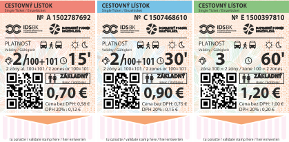
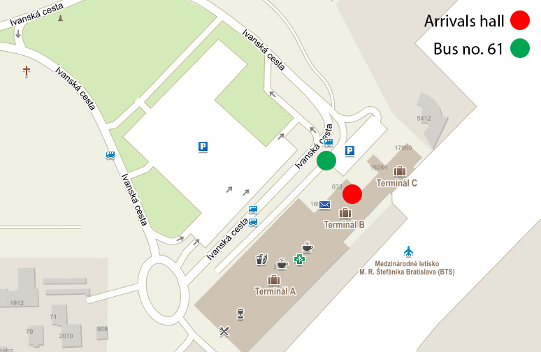
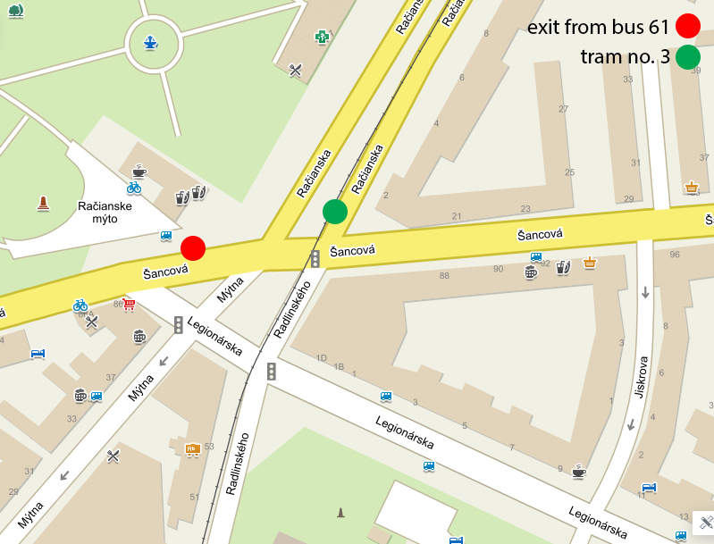
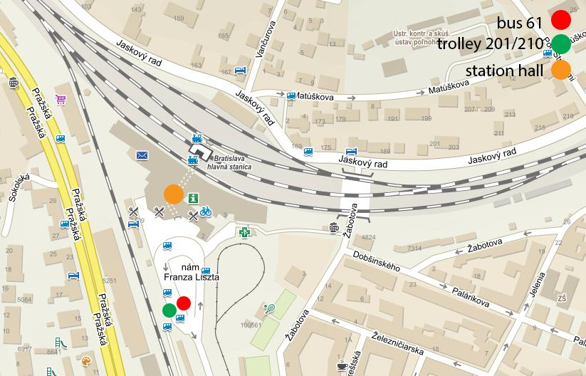
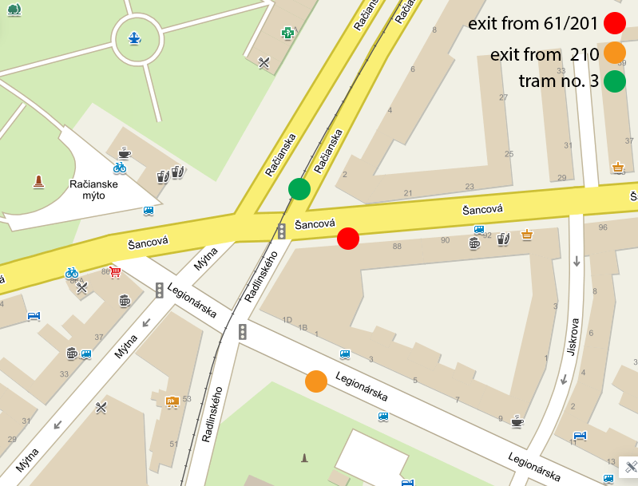
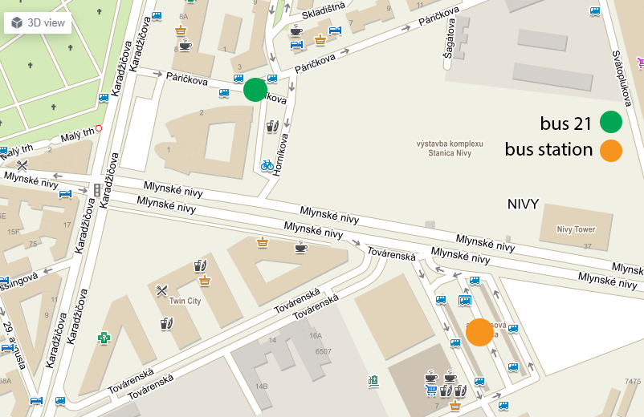

# SNT 2019, Bratislava

You can find the announcement email
[here](https://portal.ynet.sk/files/snt_19_announcment/snt_19_announcment.html)

#### SNT or SNMP?

We've found a new shortcut for SNT'19 - not **Simple Network
Management Protocol** but **Student Network Meetup Pressburg** ;-)

### Some basic info

- Location: [Bratislava](https://www.visitbratislava.com)
- Date: 15.8. - 18.8.2019
- Organizer: [Ynet](../networks/bratislava_ynet.md)
- Capacity: +- 80 beds
- Contact: <snt19@ynet.sk>

## Agenda
| Time/Day | Thursday | Friday | Saturday | Sunday |
| --- | --- | --- | --- | --- |
| 8:00 | -- | *Breakfast* | *Breakfast* | *Breakfast* + travel snack |
| 9:00 | | | | |
| 10:00 | | Transport to Slovak academy of sciences | **City Tour** | **Checkout** Free program Closing |
| 11:00 | | **Lectures** | | |
| 12:00 | | | | |
| 13:00 | | | | |
| 14:00 | -- **Arrival** -- of attendees | Transport to Hotel Suza | *Lunch* @ Craft BEER Gallery | |
| 15:00 | | *Lunch* | | -- |
| 16:00 | | | **Ynet tour** Mlynska Dolina | |
| 17:00 | | **Museum of transportation** | | |
| 18:00 | **Opening** Ynet presentation | | *Dinner -> Grill Party* | |
| 19:00 | *Dinner* | Return to Mlada Garda | | |
| 20:00 | **Club presentations** I. block | Dinner (Pizza) **Club presentations** II. block SNT Talks | | |
| 21:00 | | | | |
| 22:00 | | | | |
| 23:00 | | | | |
| 23:30 | | | | |

## Menu

| | Thursday | Friday | Saturday | Sunday |
| --- | --- | --- | --- | --- |
| Breakfast | -- | buffet | buffet | buffet |
| Lunch | -- | Soup: Carrot cream with ginger | Soup: Chicken soup Veg: Vegetable soup | Baquettes to go |
| | -- | Turkey steaks with smoked cheese and basil w/ mashed potatoes | Pork steak on black beer /w steamed rice and vegetables | |
| | -- | Veg: Homemade pasta with parmegano and ratatouille | VEG: Fried zucchini in panko and sesame /w boiled potatoes and herb dressing | |
| Dinner | Soup: Vegetable soup | Pizza tomatoes, cheese, mushrooms, corn tomatoes, cheese, bacon, sausage, onion tomatoes, cheese, quatro formaggi | **Grill party** BBQ ribs Persian chicken shashlik Sous vide pork steak with thyme veg: Grilled brie with vegetables | -- |
| | Chicken gordon w/ baked rosemary potatoes | | | |
| | VEG: Grilled smoked cheese w/ baked rosemary potatoes | | | |

#### Club presentations

Every club should prepare quick presentation of your club ( around 5
minutes ), what changed or what you have new since last year. If you are
first attending SNT, please include some details about your
club/network/processes, but keep it short :)

Please send us the presentation slides at least one day before SNT
(14.8.2019) to snt19@ynet.sk (Subject: Club name presentation)

## Accommodation

Accommodation will be provided at **Mlada Garda** dormitory. Dorm is
located on street "Račianska 103". [Google
maps](https://goo.gl/maps/mNGryuaoc1H1gYwp7)

**More details** about accommodation, room equipment, beds etc will be
here **later**.

## Arriving

### General info about tickets, validating ticket etc

Check our drawing card how to get dorm Mladá Garda by public transport:
Tickets for public transport are valid for a certain period of time and
are available from ticket-machines or kiosks. **They must be validated
once inside the first tram/bus**. Tickets are valid for all means of
public transport in the city and remain valid when changing from one
means of transport to another. Tickets have a minimum validity of 15
minutes and the longest is 7 days.

#### Example of tickets

{ width="200" }

#### Map of public transport

Map of public transport in Bratislava can be found here: [External
Link](https://bratislava.blob.core.windows.net/media/Default/Obrázky/Denne-linky-20190622.jpg)

#### Travelling a your own?

We suggest to use this website/mobile app to find public transport
timetables if you want to wonder around the city at your own: [External
Link](https://imhd.sk/ba/public-transport)

### Plane (BTS)

At airport take **bus 61** to bus stop "Račianske mýto" and then go
back 50m, after crossing tram rails take **tram 3** (direction Rača) to
tram stop "Mladá Garda". Transfer takes about 35 minutes, you should
buy at the airport 60min public transport ticket. 
{ width="400" }
{ width="350" } 
**Picture 1** - map of airport, **Picture 2** - transfer station
"Račianske mýto"

### Train

At main train station take **tram 2** to the "Blumentál" station and
then wait at same side of station for the **tram 3** (direction Rača) to
"Mladá Garda" station. Transfer takes about 20 minutes, you should buy
at the station 30min public transport ticket.

Alternatively take **bus 61** or **trolley 201** (alternatively trolley
210) to the "Račianske mýto" station and then take **tram 3**
(direction Rača) to tram stop "Mladá Garda". 
{ width="400" }
{ width="340" } 
**Picture 1** - map of train station, **Picture 2** - transfer station
"Račianske mýto"

### Bus

Bus station is in reconstruction - temporary bus station is located
closely to original station. At alternate place take **bus 21**
(direction Devínska Nová Ves) to station "Račianske mýto" and then
take **tram 3** to the "Mladá Garda" station. Transfer takes about 20
minutes, you should buy at the station 30min public transport ticket. 
{ width="400" }

### Car / taxi

##### CAR

If you are travelling with car, you can park here (N48.177578,
E17.127514)

##### TAXI

5€ Taxi (0918 555 555) You can use Bolt,Uber or Hopin

## Attendees list

TODO

| Country | City | Club | Registrations |
| --- | --- | --- | ---: |
| Slovakia | Bratislava | Ynet | 15+ event organizers |
| | Zilina | Internet Klub | 6 |
| | Kosice | PC Klub Bozeny Nemcovej 1 | 2 |
| | | PC Klub J9 | 6 |
| | | PC Klub J13 | 2 |
| Czech Republic | Prague | Silicon Hill | 10 |
| | | Sincoolka | 1 |
| Germany | Karlsruhe | Steinbuch Centre for Computing at KIT | 3 |
| | | Domus7 | 1 |
| | Chemnitz | Chemnitzer StudentenNEtz | 6 |
| | Göttingen | Kellnerweg dormitory | 4 |
| | Freiberg | StuNet Freiberg | 3 |
| | Dresden | AG DSN | 15 |
| | Stuttgart | Selfnet | 10 |
| | Ilmenau | FeM | 6 |
| | Munich | StuStaNet | 5 |
| | Erlangen | Rommelwood | 6 |
| France | Multiple cities | FedeRez | 4 |
