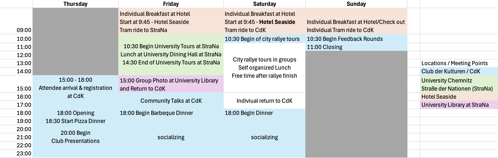

# SNT 2024, Chemnitz

**Host**: [CSN](https://www.csn.tu-chemnitz.de/)
**Date**: 29.08.2024-01.09.2024
**Location**: Chemnitz

------------------------------------------------------------------------

## Location
Club der Kulturen (CdK), Thüringer Weg 3, 09126 Chemnitz

Map of relevant area: <https://u.osmfr.org/m/1105151>

Further locations:

- Club der Kulturen (CdK): low rise building between Thüringer Weg 3 and 5, 09126 Chemnitz
- Hotel Seaside: Bernsdorfer Str. 2, 09126 Chemnitz
- University at Straße der Nationen (StraNa): Straße der Nationen 62, 09111 Chemnitz
- University Library at StraNa: Straße der Nationen 33, 09111 Chemnitz

### Arrival by public transport

Leave at Chemnitz main station
Take Tram 3 to Technopark, exit at Bernsbachplatz for the hotel
The high building is the Hotel Seaside, where you may check in after 15:00
Take Tram 3 again to Technopark, exit at TU Campus
Walk 3 minutes to CdK

## FAQ

- The accomodation is generally self organized, with the Code at Hotel Seaside.
  If the network isn't able to pay, they can ask CSN for covering the costs.
- Your ticket to SNT also covers public transit starting Friday, 30. August to
  Sunday, 1. September.

## Schedule

{ width="900" }

### Thursday, 29.08.2024

- We welcome you between 15:00 to 18:00 in Chemnitz at the location of this year's
  SNT, "Club der Kulturen", **CdK**, Thüringer Weg 3.
- Please come by our registration desk and collect your ticket as well as all other
  necessary things.
- For dinner Pizza will be served and after an introduction each attending network
  can present a short presentation of themselves for 5 minutes.
- When presentations have finished you can hang out at CdK and until you want to go
  to the hotel

### Friday, 30.08.2024

- In the morning, there is a breakfast option for all room, booked with our code at
  the hotel, use it freely.
- We meet at 9:45 in front of the hotel and take a tram to the university at the
  centre at Straße der Nationen, **StraNa**.
- Starting at 10:30, there will be tours around different research projects at the
  university as well as a tour behind-the-scenes of the university library.
- We will have lunch at the university dining hall at StraNa
- After lunch is finished, the tours continue until around 14:30
- At 15:00, we take a group photo infront of the library building and head back to CdK
- When we all arrived at CdK, there will be some longer talks.
- In the evening there will be a barbeque dinner at CdK and more communal time

### Saturday

- After the breakfast at the hotel in the morning, we will commute to CdK.
- In groups we will start the rallye across the city. 
- You can grab something to eat within the rallye on an individual basis.
- After the rallye you can have some free time in the city and come back as you see
  things fit in the afternoon.
- At 18:00 there will be a buffet dinner at CdK and further communal time afterwards

### Sunday

- Take a breakfast at the hotel in the morning, check out by yourself.
- You can depart any time, as you might have a longer journey home.
- If you have some time left, you can come to CdK once for some feedback opportunity
  and some closing remarks. We have also some packed snacks (Lunchpaket) for your trip home.

## Participating networks and attendee count

- AG DSN: 10
- CTU Prague: 1
- HaDiNet: 6
- Netz-AK Tübingen: 2
- Netz.ac Aachen: 1
- Pod-O-Lee CTU Student Union: 1
- PCKLUB Jedlíkova 9, Košice, Slovakia: 14
- PCKLUB Jedlíkova 13, Košice, Slovakia: 6
- SchunterNet e.V.: 1
- Selfnet: 10
- Sincoolka (CTU SU): 2
- StuNet Freiberg: 4
- StuStaNet: 6
- Ynet: 12
